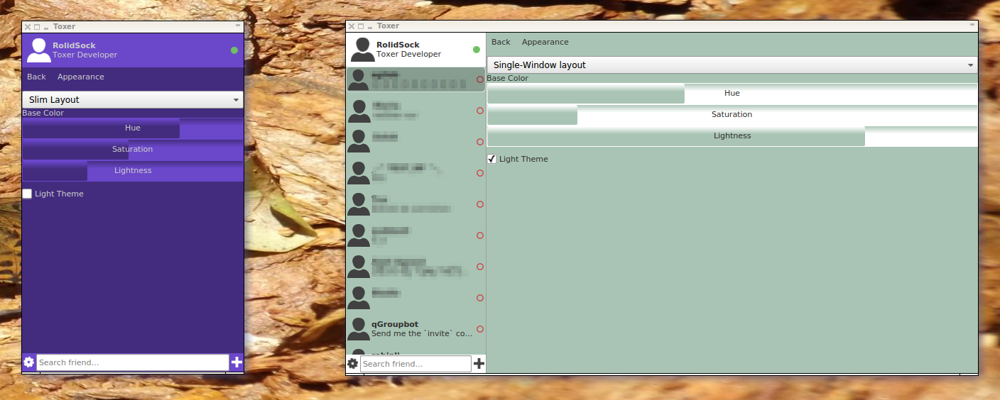

# Toxer: The Tox-messenger that simply fits.
Have you always been waiting for a Tox client, that simply works on your device(s), while at the same time looks beautiful and smooth without compromising security? This is what Toxer aims to become.

## Resources:

* Contact:
    * **Tox protocol (a.k.a toxcore)** based questions/suggestions are answered by our competent Tox enthusiasts on IRC channels [#tox-dev](irc://irc.freenode.net/#tox-dev) and [#toktok](irc://irc.freenode.net/#toktok)
    * For feature requests on Toxer, please file an issue or [contribute](CONTRIBUTE.md).

## Status: 1.0-pre-alpha
**Please note our baby is just born and learning to walk!**

In this status we focus on setteling the code basis and the release-chain. Not everything might work for you right from start… please be patient. If you have an idea where you can help out, you are welcome!

## Downloads (binary releases)

* [Linux/X11 (Desktop, 64-bit) nightly archive](https://build.tox.chat/view/toxer/job/toxer_build_linux_x86-64_release/lastSuccessfulBuild/artifact/toxer_build_linux_x86-64_release.tar.xz)
    * requires some Debian 8 compatible system libraries.
    * known to work on any "Ubuntu 16.04 (Xenial)" compatible distro

If it does not work or you want to check out Toxer on other platforms, you need to compile from source. If you want to help on this side, please contact the community as written in the [Resources](#resources) section.

### Progress

The following table provides a good overview of what is there and what is missing in order to provide the basic functionality.

Feature | Core-Functionality | UI | TODO / Note
---- | ---- | ---- | ----
Encryption | 100% | nothing to see | nothing to add
Profile-Management | 100% | 95% | ui is not scaling well yet -> change layout!
Tox-Bootstrap | 100% | 0% | visualize the DHT nodes (list/graph view - 3d?)
Friends | 100% | 100% | 
Chat | 0% | 20% | separate window on desktop; page on mobile
Group-Chat | 0% | 0% | separate window on desktop; page on mobile
History | 0% | 0% | required for messenger to work
User-Settings | 100% | 30% | create a nice UI
Styles/Themes | 100% | 100% | base color and light/dark icon & text theme

# Vision
The Toxer project has a strong focus on providing a quality messenger for Tox that scales well on any platform and does not provide any artificial features not provided by the Tox-API (a.k.a toxcore).

## Focus on lean resources
A scaling user interface doesn't require a huge amount of memory or other hardware resources. Toxer is based on the QtQuick 2 technology and methodology, which perfectly combines native- and web-development technologies to create  "lightweight" (reasonable memory footprint) and astonishing powerful user interfaces.

## Focus on flexibility
Toxer compiles and runs for any platform supported by Qt/QtQuick 2. The user interface scales nicely to the screen by using a well-thought layout.

## Focus on stability
Tox is a pretty stable protocol standard - and so should be the client. By using a streamlined code design, that encapsulates access in a unique way, Toxer allows everybody to easy understand the code-flow according to his or her skills. This makes the code run rock-solid and reduces the calls for software tests due to instable coding. Nothing against unit tests in useful places though… :)

## Focus on simplicity
Simplicity overlaps with stability. When the code is easy to understand, even for newcomers, this reduces the hurdles and increases motivation to learn and improve the program all the way. Toxer strives to provide exactly that, without lacking features or functionality.

# License
The Toxer application is freely usable under the terms of the MIT license. The licenses of the underlying libraries (e.g. Qt and toxcore) also apply to these components. If you plan to re-use the code, please contact the Tox community.
